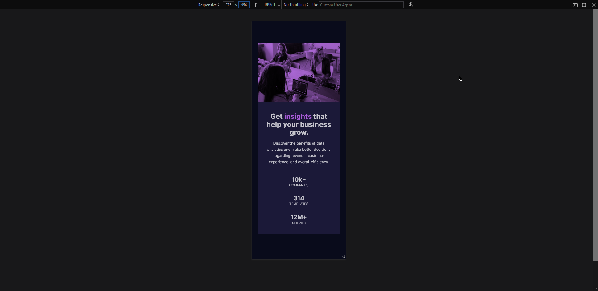
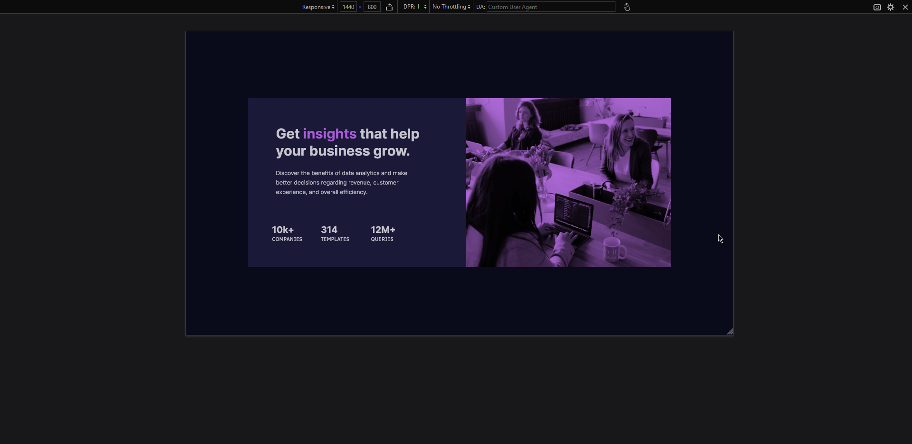

# Frontend Mentor - Stats preview card component solution

This is a solution to the [Stats preview card component challenge on Frontend Mentor](https://www.frontendmentor.io/challenges/stats-preview-card-component-8JqbgoU62). Frontend Mentor challenges help you improve your coding skills by building realistic projects.

## Table of contents

- [Overview](#overview)
  - [The challenge](#the-challenge)
  - [Screenshot](#screenshot)
  - [Links](#links)
- [My process](#my-process)
  - [Built with](#built-with)
  - [What I learned](#what-i-learned)
- [Author](#author)

**Note: Delete this note and update the table of contents based on what sections you keep.**

## Overview

### The challenge

Users should be able to:

- View the optimal layout depending on their device's screen size

### Screenshot

#### Mobile Version



#### Desktop Version



### Links

- Solution URL: [The solution on my Github.](https://github.com/matthewjdavison/FrontEndMentor_Stats-Preview-Card-Component-Challenge)
- Live Site URL: [Live Site URL](https://matthewjdavison.github.io/FrontEndMentor_Stats-Preview-Card-Component-Challenge/)

## My process

### Built with

- Semantic HTML5 markup
- CSS custom properties
- Flexbox
- CSS Grid
- Mobile-first workflow
- Figma

### What I learned

I came up with the idea of putting the design image inside Figma which allowed me to quite easily figure out the spacing and sizings based on "tracing" the design image.  I also figured out how to make image overlays.

To see how you can add code snippets, see below:

```html
<div class = "card__image"></div>
```

```css
.card__image {
  background: url(images/image-header-mobile.jpg) var(--clr-image-overlay);
  background-blend-mode: multiply;
}
```

## Author

- Website - [Matthew Davison](https://matthewdavison.netlify.app/)
- Frontend Mentor - [@matthewjdavison](https://www.frontendmentor.io/profile/matthewjdavison)
- Twitter - [@mattdavisonuk](https://www.twitter.com/mattdavisonuk)
